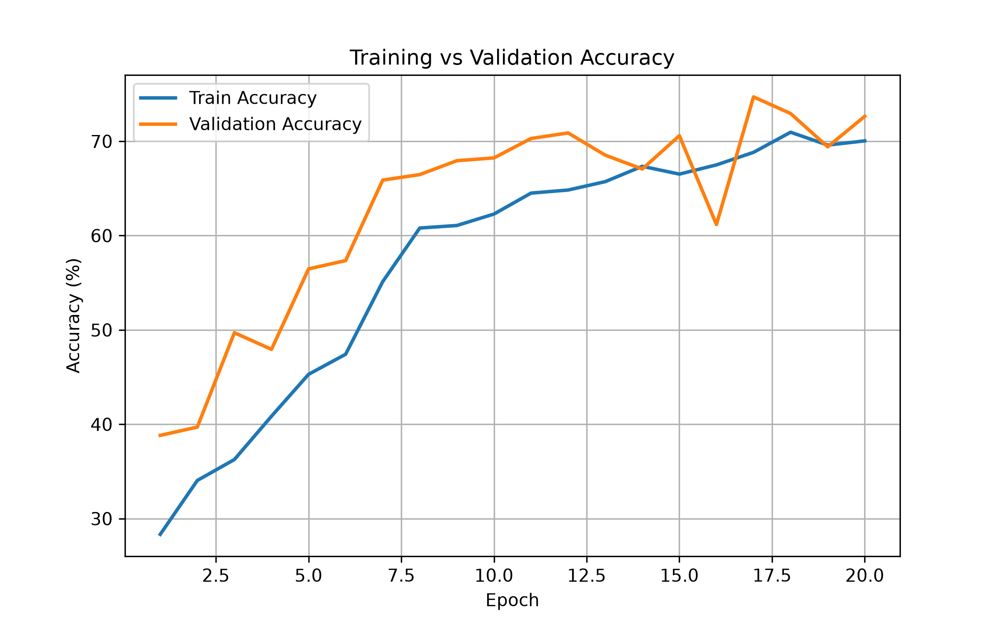
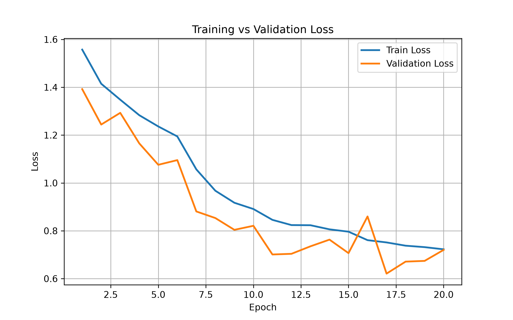
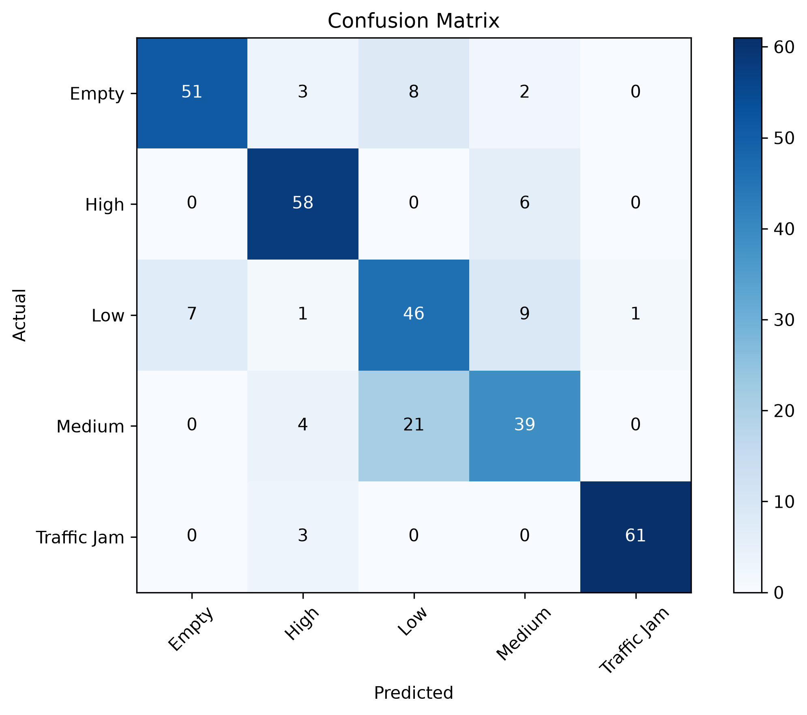

# 🚦 Traffic Image Classification using Deep Learning

A Computer Vision project that classifies traffic images into five traffic conditions using a Custom Convolutional Neural Network (CNN) built with PyTorch.


## 📌 Project Overview
This project implements a complete deep learning pipeline for traffic image classification using PyTorch.

Two different approaches were implemented and compared:

• A Custom Convolutional Neural Network (CNN) built from scratch.
• A pretrained ResNet18 model using transfer learning.

The project includes dataset preprocessing, data augmentation, model training, evaluation, performance visualization, and single-image prediction.

## 📂 Project Structure

```text
traffic-image-classification
│
├── Notebooks/
├── outputs/
│   └── graphs/
│       ├── accuracy_curve.png
│       ├── loss_curve.png
│       └── confusion_matrix.png
│
├── src/
│   ├── config.py
│   ├── dataset.py
│   ├── model.py
│   ├── train.py
│   ├── evaluate.py
│   ├── predict.py
│   └── graphs.py
│
├── requirements.txt
├── README.md
└── LICENSE
```
## 🧠 Model Architecture

Custom CNN

Input (128×128×3)

↓

Conv2D (32 Filters)

↓

ReLU

↓

MaxPooling

↓

Conv2D (64 Filters)

↓

ReLU

↓

MaxPooling

↓

Conv2D (128 Filters)

↓

ReLU

↓

MaxPooling

↓

Adaptive Average Pooling

↓

Fully Connected Layer

↓

Dropout (0.5)

↓

Output Layer (5 Classes)

## 🧠 Implemented Models

### Custom CNN

- 3 Convolution Blocks
- ReLU
- MaxPooling
- Adaptive Average Pooling
- Dropout
- Fully Connected Layers

### ResNet18

- ImageNet pretrained weights
- Fine-tuned Layer4
- Custom Fully Connected Classifier

## 📊 Model Comparison

| Model | Training Strategy | Test Accuracy |
|--------|-------------------|--------------:|
| Custom CNN | Built from Scratch | **79.38%** |
| ResNet18 (Classifier Only) | Transfer Learning | **66.56%** |
| ResNet18 (Layer4 + FC Fine-Tuning) | Transfer Learning | **79.69%** |

## 📈 Results

### Custom CNN

- Test Accuracy: **79.38%**

### ResNet18 (Fine-Tuned)

- Test Accuracy: **79.69%**

The transfer learning approach achieved the highest accuracy on the test dataset.

### Observation

The initial ResNet18 experiment trained only the final classification layer and achieved 66.56% test accuracy.

After fine-tuning the last residual block (`layer4`) together with the classifier using a lower learning rate, the model improved to **79.69%**, slightly outperforming the custom CNN baseline.

## ⚙️ Training Configuration

| Parameter | Value |
|-----------|------:|
| Epochs | 20 |
| Batch Size | 8 |
| Learning Rate | 0.001 |
| Optimizer | Adam |
| Loss Function | Weighted CrossEntropyLoss |
| Image Size | 128×128 |

## 📊 Results

| Metric | Value |
|--------|------:|
| Test Accuracy | **79.38%** |
| Classes | 5 |
| Framework | PyTorch |

## ✨ Features

- Custom CNN implementation
- Transfer Learning using ResNet18
- Data Augmentation
- Weighted CrossEntropyLoss
- Adam Optimizer
- Model Checkpointing
- Training History Logging
- Accuracy and Loss Curves
- Confusion Matrix Visualization
- Classification Report
- Single Image Prediction

## 📷 Visualizations

### Training Accuracy



---

### Training Loss



---

### Confusion Matrix


## 🔍 Predict a Single Image

```bash
python src/predict.py
```

Example

```text
Prediction : High
Confidence : 73.74%
```
## 🚀 Installation

```bash
git clone https://github.com/sathwikchiliveri/traffic-image-classification.git

cd traffic-image-classification

pip install -r requirements.txt
```
## ▶️ Usage

Train

```bash
python src/train.py
```

Evaluate

```bash
python src/evaluate.py
```

Predict

```bash
python src/predict.py
```
## 🚀 Future Work

- MobileNetV3 Comparison
- EfficientNet Comparison
- Streamlit Web Application
- Grad-CAM Visualization
- Real-Time Webcam Prediction
- 
- ## 🛠️ Tech Stack
- Python
- PyTorch
- Torchvision
- NumPy
- Pandas
- Matplotlib
- Scikit-learn
- 
- ## 📄 License
This project is licensed under the MIT License.
